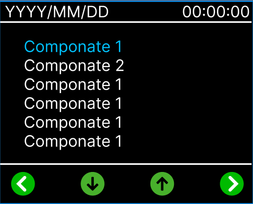
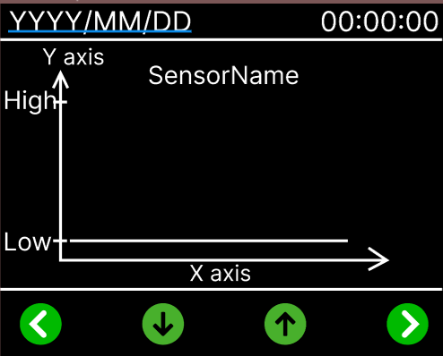
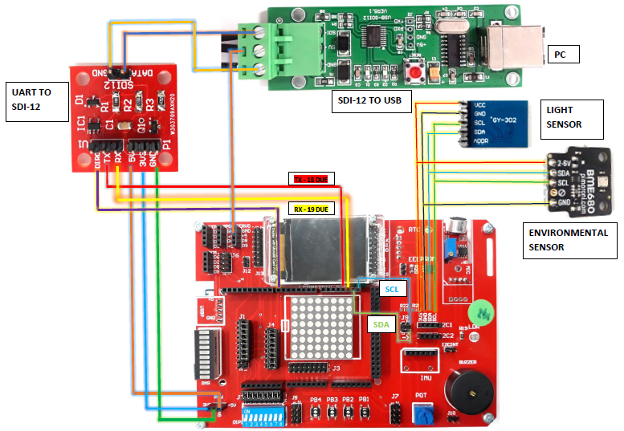

# SDI-12 Data Logger with Environmental Sensing

The SDI-12 Data Logger project is designed to capture environmental data using various sensors connected to an Arduino board. This sophisticated system integrates functionalities for temperature, humidity, pressure, gas resistance, altitude, and light level measurement. It also features an LCD display for real-time data visualization, SD card logging for data storage, and LED alerts for specific sensor thresholds.

## Table of Contents

- [System Overview](#system-overview)
- [SDI-12 Command Support](#sdi-12-command-support)
- [Interrupts and Timers](#interrupts-and-timers)
- [Display Overview](#display-overview)
- [Hardware Requirements](#hardware-requirements)
- [Software Dependencies](#software-dependencies)
- [Installation](#installation)
- [Usage](#usage)
- [How It Works](#how-it-works)
- [Customization](#customization)
- [Troubleshooting](#troubleshooting)
- [Version History](#version-history)
- [Support and Contact Information](#support-and-contact-information)
- [Credits](#credits)
- [Appendix and References](#appendix-and-references)

## System Overview

The SDI-12 Data Logger leverages Arduino technology to monitor and record environmental conditions. It uses a range of sensors to measure temperature, humidity, pressure, gas resistance, altitude, and light levels, providing valuable insights into the surrounding environment.

**Features:**

- **Multi-Sensor Integration:** Utilizes the Adafruit BME680 for temperature, humidity, pressure, gas resistance, and altitude measurements, along with the BH1750 for light level detection.
- **Real-Time Data Display:** Features an LCD display powered by Adafruit GFX for showing current sensor readings and a graph of historical data.
- **SDI-12 Communication:** Supports SDI-12 protocol for sensor data communication, allowing for easy integration of compatible sensors.
- **Data Logging:** Saves sensor readings to an SD card for long-term observation and analysis.
- **Interactive Interface:** Includes button-based navigation for interacting with the device and switching between different data views.
- **Threshold Alerts:** LEDs light up when sensor values exceed predefined thresholds.
- **Watchdog Timer:** Implements a watchdog timer to reset the board if it becomes unresponsive.

## SDI-12 Command Support

The SDI-12 Data Logger supports a subset of the SDI-12 protocol, a standard for digital communication with environmental sensors. The device can interpret and respond to the following SDI-12 commands:

- **Address Query (`?!`):** Checks the address of the SDI-12 sensor module. The module will respond with its current address.
- **Change Address (`aAb!`):** Changes the address of the sensor module where `a` is the current address and `b` is the new address.
- **Send Identification (`aI!`):** Requests the identification information from the sensor. The response will include the sensor address, SDI-12 version compatibility, vendor identification, and a serial number.
- **Start Measurement (`aM!`):** Instructs the sensor to begin a measurement cycle. The response indicates the time until the data will be ready and the number of data values that will be returned.
- **Send Data (`aDx!`):** Requests the data from a measurement where `x` is the data index. The sensor responds with the requested measurement value(s).
- **Continuous Measurements (`aRx!`):** Configures the sensor to perform continuous measurements.

Each command consists of a single letter (the address of the sensor), followed by a command code and a terminating exclamation mark (`!`). Responses from the device typically end with a carriage return and line feed (`<CR><LF>`).

## Interrupts and Timers

The SDI-12 Data Logger employs interrupt service routines (ISRs) to handle asynchronous events efficiently, allowing the system to react immediately to certain conditions, such as available sensor data or button presses, without polling these devices continuously.

### Timer Interrupts

Timer interrupts are used to schedule regular tasks, such as reading sensor data at consistent intervals. The Arduino’s built-in timers are configured to trigger an interrupt that executes a function — this is particularly useful for continuous measurement modes where data must be sampled at steady, predefined rates.

### Hardware Interrupts

The hardware is also designed to utilize interrupts triggered by external events. This mechanism is applied to the button inputs, which allows the system to respond instantaneously when a user interacts with the device, improving the efficiency and responsiveness of the user interface.

### Software Interrupts

Software interrupts are triggered when sensor values exceed predefined thresholds, activating LEDs connected to pins 48, 49, 50, 51, 52, and 53. This feature ensures immediate visual alerts for critical environmental conditions.

## Display Overview

The LCD display is a crucial interface for the SDI-12 Data Logger, providing real-time data visualization and system interaction. Below are the two primary display modes of the device:

### Sub Menu

This menu displays the current date and time, sensor readings, and navigational prompts. It is the main interface for sensor selection and system navigation.

### Show Data Option

When selecting a specific sensor from the Sub Menu, the display will switch to the data visualization mode, showing a graphical representation of the sensor data over time. The improved display now shows the last 20 data points, with the Y-axis representing the value range and the X-axis indicating time or data points.

Both displays integrate interactive elements such as buttons for navigation (`<`, `>`) and selection (`∧`, `∨`). The intuitive design ensures straightforward operation for various user interactions, from sensor data review to system configuration.

### Dual Button Press Functionality

A specific feature of the data logger is the ability to turn the LCD display on or off by pressing two designated buttons simultaneously. This function conserves power and extends operational life when continuous display is not necessary. The logic is integrated into the main loop, and debouncing techniques ensure reliable detection of button presses.

## Hardware Requirements

- Arduino-compatible board ( Arudino due Bord)
- Adafruit BME680 sensor
- BH1750 light sensor
- SD card module
- Adafruit ST7735 LCD display
- Generic buttons (x4)
- LEDs (x6) for threshold alerts
- Miscellaneous: breadboard, jumper wires, etc.

## Software Dependencies

- Adafruit GFX Library
- Adafruit BME680 Library
- BH1750 Library
- Adafruit ST7735 and ST7789 Library
- RTClib Library
- SdFat Library
- SPI Library
- Wire Library

## Installation

1. **Library Installation:** Ensure all required libraries are installed in your Arduino IDE. Most can be found in the Library Manager.
2. **Hardware Setup:** Connect all hardware components as per the schematic diagram.
   
3. **Upload the Sketch:** Open the provided `.ino` file in the Arduino IDE, select your board and port, then upload the sketch to your Arduino.

## Usage

After setting up the hardware and uploading the code, follow these steps to use the SDI-12 Data Logger:

1. Power on the device.
2. Use the buttons to navigate through the menu on the LCD display.
3. View real-time sensor data or historical data graphs.
4. Sensor data is automatically logged to the SD card.

Refer to the button functions diagram for navigation. (Insert button_functions_diagram.png here)

## How It Works

- **Sensor Readings:** The Adafruit BME680 and BH1750 sensors measure environmental conditions. Sensor data is processed and displayed on the LCD in real-time.
- **SDI-12 Communication:** Implements the SDI-12 protocol for digital communication with sensors, enabling efficient data transmission.
- **Data Logging:** Measured data is logged to an SD card, allowing for data collection over extended periods.
- **User Interface:** The device's buttons are used to interact with the graphical user interface on the LCD display, which shows sensor data and graphs.
- **Interrupt-Driven Measurement:** The system's interrupt-driven design allows for accurate timing of measurements. When the timer interrupt occurs, the system captures data from the sensors, processes it, and then either displays it on the LCD or logs it to the SD card, depending on the current mode of operation.
- **Threshold Alerts:** LEDs light up when sensor values exceed predefined thresholds, providing immediate visual feedback for critical conditions.
- **Watchdog Timer:** A watchdog timer resets the board if it becomes unresponsive, ensuring continuous operation.

## Customization

You can customize the data logger by modifying the Arduino sketch. This includes changing the sensors used, adjusting the display layout, or modifying the SDI-12 commands.

## Troubleshooting

- **Display Issues:** Ensure all display connections are secure. Try reinitializing the display in the setup.
- **Sensor Errors:** Verify wiring and check if the correct I2C address is used. Ensure libraries are up to date.
- **SD Card Problems:** Confirm the SD card is formatted correctly and check the card's connections.
- **Interrupt Handling Issues:** Ensure that the timer and button interrupts are correctly set up in the code. If interrupts are not triggering as expected, verify the interrupt pin connections and ensure that the corresponding ISRs are properly defined.
- **Threshold Alerts:** Check the LED connections and verify the threshold values set in the code.

## Version History

`1.0.0` - Initial release of the SDI-12 Data Logger system documentation.
`2.0.0` - Added save functionality from the menu, improved data visualization to show the last

 20 data points, integrated software interrupts for sensor thresholds, added LED alerts, and implemented a watchdog timer.

## Support and Contact Information

Should you encounter any issues or have questions regarding the SDI-12 Data Logger, please don't hesitate to reach out via email for assistance:

- **Email:** [sakuna.nagodavithana@gmail.com](mailto:sakuna.nagodavithana@gmail.com)

## Credits

**[@Sakuna-Nagodavithana](https://github.com/Sakuna-Nagodavithana)**
**[@Vichithra-Dias](https://github.com/Vichithra-Dias)**
**[@Zehpy86](https://github.com/Zehpy86)**

## Appendix and References

To enhance your understanding and implementation of the SDI-12 protocol or to gain in-depth knowledge about the BME680 sensor, the following resources are recommended:

- [SDI-12 Support Group](https://www.sdi-12.org) - Comprehensive information and support for the SDI-12 protocol.
- [BME680 Details](https://cdn-shop.adafruit.com/product-files/3660/BME680.pdf) - Detailed specifications and usage information for the BME680 sensor.
- [BH1750 Details](https://cdn-learn.adafruit.com/downloads/pdf/adafruit-bh1750-ambient-light-sensor.pdf) - Detailed specifications and usage information for the BH1750 sensor.
- [TFT Display Graphics](https://cdn-learn.adafruit.com/downloads/pdf/adafruit-gfx-graphics-library.pdf)

